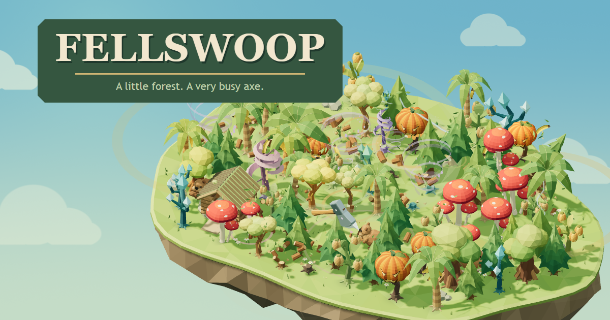

# FELLSWOOP

**A little forest. A very busy axe.**

Play it: **https://tront.xyz/fellswoop/**

An idle chopping game on a floating island. The axe follows your mouse and chops whatever is under it; no clicking required. Trees fall, stumps regrow, logs fly home. Swing off the island and the axe turns into a helicopter.

Every day is a short harvest. Bank the wood, spend it in the workshop, and the forest gets sillier: pumpkins that explode, banana palms that throw fruit, thunder trees that chain lightning, vortex storms, amber sap, seedpods, ancient oaks worth a jackpot, and a lodge of beavers that gnaw trees and carry logs home. Then axe it all again tomorrow.

## Controls

| Input | Does |
|---|---|
| Mouse | Move over the island to chop |
| Click | Power chop on the ground, gust in the air (optional) |
| Touch | Hold and drag |
| U | Workshop |
| Space | Pause |
| M | Sound |
| B | Sandbox (everything unlocked, separate from your save) |
| Esc | Back / close |

## Tech

One HTML file: Three.js r140 embedded, every model, animation, sound and the whole interface authored in code. No downloads, no build step, no server. Progress saves in your browser.

`tools/verify.mjs` is the release gate: it boots the page in headless Chrome on the real GPU and plays it with real pointer input (title, chopping, power chop, helicopter, a full day, a purchase, save and reload, sandbox isolation, the game's own invariants). Run it against a local file or the live URL.

## Credits

By Tront (Trent Sterling), built with AI coding tools. More games at [tront.xyz/games](https://tront.xyz/games/) · [Discord](https://tront.xyz/discord/)

Three.js is MIT licensed, copyright the Three.js authors.
